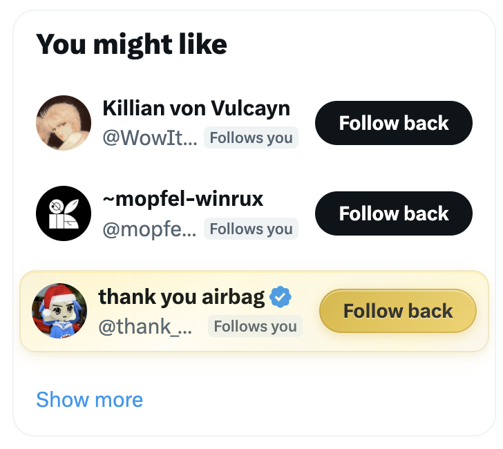

# Miladymaxxer

*elevate milady. diminish the rest.*


Chrome extension for X/Twitter. Runs a bundled ONNX classifier on avatars as you scroll. Milady posts get elevated, everything else gets diminished. Fully on-device — no server calls, no telemetry.

## Features

**Visual effects**
- Gold floating cards on milady posts, silver on 0-like posts
- Smooth animated transition on like (silver → gold, gold → richer gold)
- Hover float animation on milady cards
- Gold shimmer overlay and metallic sheen
- Gold "Follow back" / silver "Follow" buttons
- Gold-rimmed profile avatars with HDR enhancement
- Dotted underline on miladys you don't follow
- Faded pink like button to encourage engagement
- Hides downvote button on milady posts
- Non-milady posts slightly shrunk and faded
- Dark mode: warm gold / cool silver tinting with depth shadows
- Light mode: subtle cream/champagne card tinting
- Quote tweet detection — gold card when a milady is quoted

**Sound**
- Detection chime when milady avatars are found
- Media hover pips, click feedback
- DM send thup, incoming message pip
- Toggle on/off in popup

**Popup**
- Session stats: posts scanned, match rate, last detection
- Account list with per-account exemptions
- Avatar dataset export for offline labeling
- Green theme matching miladymaker.net

**Other**
- Badge counter for milady posts liked this session
- Debug mode with detection scores and markers
- Works in timelines, threads, profiles, "Who to follow", notifications

## Screenshots

| Timeline | Timeline (cont.) | Follow Button |
|----------|-------------------|---------------|
|  |  |  |

## Install

No Chrome Web Store release. Install from source:

1. Download latest `miladymaxxer-vX.Y.Z-unpacked.zip` from Releases
2. Unzip somewhere permanent
3. `chrome://extensions` → Developer mode → Load unpacked → select folder

## Development

```bash
pnpm install      # deps
pnpm run build    # build
pnpm run dev      # watch
pnpm test         # tests
```

See `DEVELOPMENT.md` for model training and debugging workflows.

## Architecture

```
src/
  content.ts     # orchestrator — scroll observer, detection loop, stats
  styles.ts      # injected CSS — cards, dark mode, hover, transitions
  sounds.ts      # Web Audio API — chimes, DM sounds, hover pips
  detection.ts   # ONNX inference and avatar classification
  effects.ts     # DOM effects — milady/diminish, fade-ins, badges
  selectors.ts   # centralized DOM selector constants
  popup.tsx      # extension popup UI (Solid.js)
```

Model artifacts in `public/models/` and `public/generated/`. Training data in `cache/` (gitignored).
